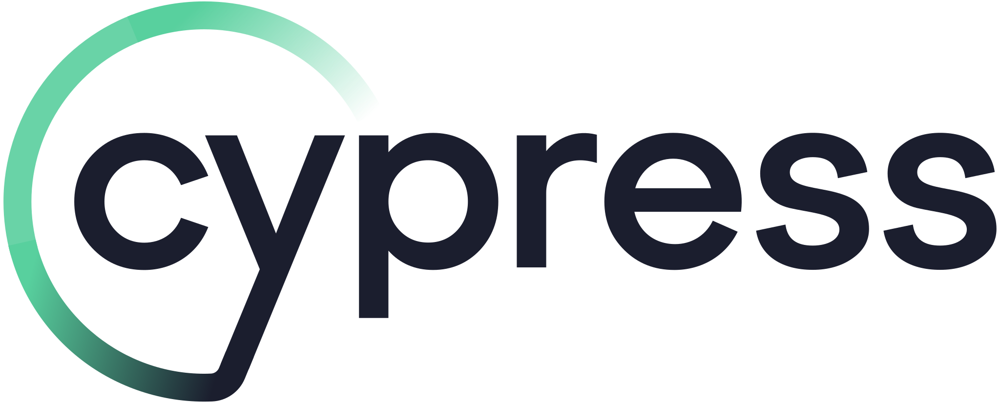

<div style="display: flex; align-items: center; justify-content: center; gap: 25px;">
    
    <span style="font-size: 50px">+</span>
    
</div>

# Cypress TypeScript Automation: SauceDemo.com

&#x20;

## 📌 Repository Purpose

This repository serves as a **demonstration of my expertise as a Test Automation Engineer** by providing a **fully configured Cypress TypeScript project** designed to test the [SauceDemo](https://www.saucedemo.com/) website.

The goal of this repository is to provide:

- A **structured Cypress automation framework** using **TypeScript**.
- An **example of scalable, maintainable test automation**.
- A **starting point for those looking to implement Cypress with TypeScript** in real-world applications.

---

## 🛠 How to Use This Repository

### **1. Prerequisites**

Before using this repository, ensure you have the following installed:

- **Node.js** (v20 or v22 recommended) - [Download Here](https://nodejs.org/)
- **npm** (v10+ required)
- **Git** (to clone the repository) - [Download Here](https://git-scm.com/)
- **VS Code (or any IDE with TypeScript support)** - [Download Here](https://code.visualstudio.com/)

### **2. Clone the Repository**

Open a terminal and run the following command:

```sh
git clone https://github.com/your-github-username/cypress-ts-saucedemo.git
cd cypress-ts-saucedemo
```

### **3. Install Dependencies**

Run the following command to install Cypress and other required dependencies:

```sh
npm install
```

### **4. Running Cypress Tests**

To **open Cypress Test Runner** and run tests interactively:

```sh
npx cypress open
```

To **run all tests in headless mode**:

```sh
npx cypress run
```

---

## 📌 Current Test Coverage

Currently, this repository includes tests for the **Login Page** in SauceDemo:

- `loginPage.cy.ts` - Tests login page UI elements, validation errors, invalid login attempts, and successful login.

### 🚀 **Future Test Coverage**

This repository will be **expanded** to include:

- **Inventory Page tests** (validating product listings, sorting, and filtering).
- **Cart and Checkout Flow tests**.
- **User Session Handling and Logout tests**.

---

## 📩 Want to Work Together?

If you found this project valuable and want to implement **robust test automation** for your applications, feel free to reach out!

📧 **Email:** [Email me directly](mailto:edward.b.bales@gmail.com)

🔗 **LinkedIn:** [Connect with me](https://www.linkedin.com/in/edwardbradleybales/)
